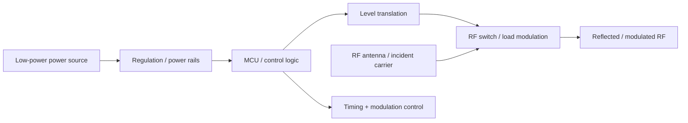

# Low-Power RF Backscatter Tag — KiCad Hardware Design

A portfolio-ready hardware repository for a **low-power RF backscatter tag** designed in KiCad. The repository captures the current PCB/schematic work and documents the intended backscatter architecture, power strategy, RF switching, and next validation steps.

> **Status:** Hardware design / prototype stage. The repository contains the current KiCad source files; RF performance claims should be treated as design targets until validated with laboratory measurements.

## Project at a glance

- **EDA:** KiCad
- **Design title:** `RF_Backscatter_Tag_250_MHz`
- **RF switching:** ADG902BRMZ
- **Logic level translation:** SN74LVC1T45DBV
- **Low-noise regulation:** TPS7A20xxxDBV
- **Antenna interfaces:** two custom antenna-pad symbols/footprints in the supplied schematic
- **Design focus:** low-power load/modulation switching for a compact RF backscatter tag

## Why backscatter?

Backscatter communication avoids generating a complete RF transmit chain on the tag. Instead, the tag changes the RF load presented to an antenna so that an incident RF wave is reflected with different states. This makes the RF front-end substantially simpler than a conventional transmitter.

The reference architecture supplied with this project uses a low-power MCU to acquire sensor data and control timing/modulation, a very-low-power timer to generate a subcarrier, and RF switches to control the reflected signal. The thesis source describes the tag as five functional parts: MCU, timer, watchdog timer, sensor board, and RF front-end. fileciteturn1file3L205-L213

## System architecture



For the thesis reference implementation, the MCU acquires sensor data with a 10-bit ADC and controls the timer and RF front-end; the MCU can enter sleep mode to reduce power. fileciteturn1file0L36-L45

## Current KiCad design

The current schematic in `hardware/Backscatter_tag_First_Version.kicad_sch` is titled **RF_Backscatter_Tag_250_MHz** and includes the following functional elements:

| Ref | Part / function | Role |
|---|---|---|
| U1 | ADG902BRMZ | RF/modulation switch |
| U2 | TPS7A20xxxDBV | Low-power regulator |
| U3 | SN74LVC1T45DBV | Logic-level translation |
| U4, U5 | Custom antenna-pad symbols | RF antenna interfaces |
| C1, C2 | 1 µF | Supply decoupling / stabilization |
| C3 | 100 nF | High-frequency decoupling |
| J1 | 1×4 connector | External interface / programming/test |

### Schematic preview


## Reference timer + RF front-end

The supplied thesis reference shows a timer/RF chain using an **XC6504 voltage reference, TS3002 low-power oscillator, ADG902 modulation switch, and ADG919 RF switch**. The timer generates a 50% duty-cycle subcarrier and the MCU controls the modulation switch. fileciteturn1file1L98-L113

The reference prototype programmed the timer to **34.3 kHz** and reported **2.62 µW** for the timer circuit including the voltage reference. These are reference-design measurements, not measurements of the current KiCad board in this repository. fileciteturn1file1L109-L113

## Reference system-level concept

The supplied reference material describes ambient/backscatter systems in which an incident RF/FM signal is reflected and modulated by the tag, with a low-cost SDR used at the receiver. fileciteturn0file0L547-L560

## Design principles demonstrated

### 1. RF load modulation

The core idea is to switch the electrical state seen by the antenna so that the reflection coefficient changes. In a backscatter system, the incident carrier supplies the RF energy and the tag encodes information through controlled reflection states. fileciteturn1file2L130-L145

### 2. Ultra-low-power timing

The reference design uses a low-power oscillator to create the tag subcarrier and an MCU-controlled switch to gate/modulate it. fileciteturn1file0L46-L56

### 3. Duty-cycled operation

The reference system uses a nano-power watchdog timer to wake the MCU periodically, allowing the processor and RF circuitry to remain off for most of the time. The cited implementation used a TPL5010 and a 4-second wake interval. fileciteturn1file9L426-L438

### 4. Simple modulation

The reference implementation uses OOK with Morse encoding for a deliberately simple, low-complexity link. The MCU creates the baseband timing while the external timer defines the subcarrier frequency. fileciteturn1file3L166-L183

## Repository structure

```text
.
├── README.md
├── .gitignore
├── hardware/
│   ├── Backscatter_Tag_First_Version.kicad_pro
│   ├── Backscatter_tag_First_Version.kicad_sch
│   ├── Backscatter_Tag_First_Version.kicad_pcb
│   └── README.md
├── manufacturing/
│   └── Tag-odb.zip
├── docs/
│   ├── ARCHITECTURE.md
│   ├── PORTFOLIO.md
│   ├── VALIDATION.md
│   └── images/
│       └── kicad-schematic.png
├── firmware/
├── simulation/
└── scripts/
    └── check_repo.sh
```

## How to open the design

1. Install KiCad 10.x.
2. Clone this repository.
3. Open `hardware/Backscatter_Tag_First_Version.kicad_pro`.
4. Inspect the schematic first, then open the PCB editor.
5. Before fabrication, run ERC/DRC and verify the RF path, supply rails, connector pinout, antenna geometry, and footprints against the exact manufacturer datasheets.

### Important reproducibility note

The supplied schematic references custom antenna symbols/footprints (`My_custom_symbols_1:Ant_smd_RF1` and `my_custom_footprints:Antenna_Pad`). The uploaded source archive did not contain the corresponding custom library files. If KiCad reports missing libraries, restore those custom libraries and update `sym-lib-table` / `fp-lib-table` before editing or manufacturing.

## Suggested next engineering steps

- Add the missing custom symbol/footprint libraries and lock library versions.
- Add the MCU, timer, watchdog, sensor and complete power tree if this repository is intended to reproduce the full reference tag rather than only the current RF board.
- Add an RF matching/load network and document the intended antenna impedance.
- Add ERC/DRC reports to `docs/validation/`.
- Add a generated BOM and component datasheet links.
- Add measured VNA/S11 data and RF-switch insertion-loss/isolation results.
- Add oscilloscope captures showing the modulation waveform.
- Add a receiver-side SDR/MATLAB or Python decoder if the complete communication chain is implemented.
- Add manufacturing outputs only after the final PCB revision has passed DRC and fabrication checks.

## Validation roadmap

| Test | Instrument | Evidence to add |
|---|---|---|
| Power-rail verification | DMM / oscilloscope | Rail voltage + current table |
| RF switch control | Oscilloscope | Control waveform |
| S11 / antenna matching | VNA | Touchstone `.s1p` + plot |
| RF insertion loss / isolation | VNA | Measurement table |
| Backscatter waveform | SDR / spectrum analyzer | IQ capture + spectrum |
| End-to-end link | SDR receiver | BER/PER vs distance |
| Power consumption | SMU / source meter | Active/sleep current |

## Reference performance context

The supplied thesis reports a proof-of-concept backscatter tag using a low-power MCU, external timer and RF front-end; its prototype consumed around **20 µW** and achieved indoor communication up to **2 m** in the described experiment. fileciteturn0file0L587-L602

Those numbers belong to the reference implementation and should **not** be presented as measured results for this repository unless independently reproduced.

## Portfolio / resume value

This project demonstrates:

- KiCad schematic capture and PCB design
- RF switch/load-modulation concepts
- low-power electronics
- power-rail and decoupling design
- digital/RF interface considerations
- antenna-interface design
- hardware documentation and reproducibility
- a clear path from schematic → PCB → RF characterization → wireless validation

## Attribution

The backscatter architecture and technical context documented here were informed by the supplied thesis *Ambient Backscatterers For Low Cost and Low Power Wireless Applications* by Spyridon Nektarios Daskalakis, Heriot-Watt University, 2020. fileciteturn0file0L2-L10

The KiCad files in `hardware/` are the current project files supplied for this portfolio repository.
